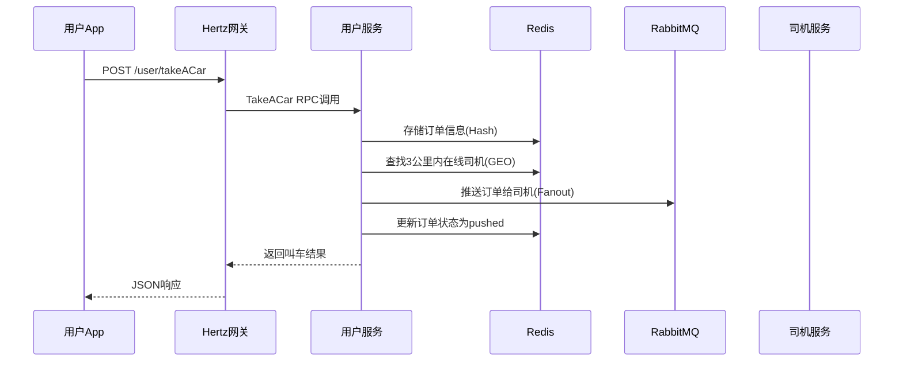
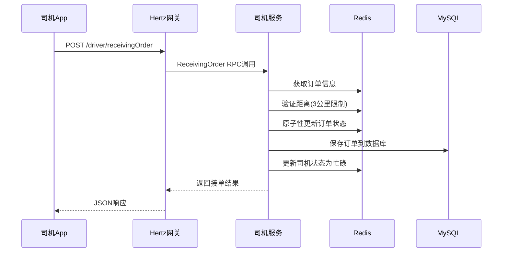
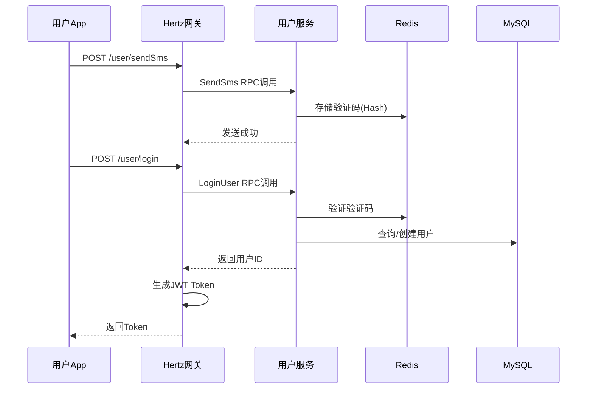

# 滴滴出行系统架构文档

## 1. 项目概述

### 1.1 项目简介
滴滴出行系统是一个基于微服务架构的网约车平台，采用Go语言开发，支持用户叫车、司机接单、实时定位、消息推送等核心功能。

### 1.2 核心特性
- 🚗 **用户叫车服务**: 支持实时叫车、位置定位、车型选择
- 👨‍✈️ **司机管理服务**: 司机注册、审核、状态管理、接单服务
- 📍 **地理位置服务**: 基于Redis GEO的3公里范围司机匹配
- 💬 **实时消息推送**: 基于RabbitMQ的订单分发和状态通知
- 🔐 **身份认证系统**: JWT Token认证和实名认证
- 📱 **RESTful API**: 标准化的HTTP接口设计

## 2. 技术架构

### 2.1 技术栈

#### 后端框架
- **Kitex**: 字节跳动高性能RPC框架，用于微服务间通信
- **Hertz**: 字节跳动高性能HTTP框架，用于API网关层
- **Thrift**: 接口定义语言(IDL)，定义服务接口

#### 数据存储
- **MySQL**: 主数据库，存储用户、司机、订单等核心数据
- **Redis**: 缓存和地理位置服务
  - 验证码存储(Hash)
  - 订单信息缓存(Hash) 
  - 司机位置信息(GEO)
  - 司机状态管理(Hash)

#### 消息队列
- **RabbitMQ**: 异步消息处理
  - 订单分发给周边司机
  - 司机接单状态通知
  - 系统状态变更通知

#### 其他组件
- **JWT**: 用户身份认证和授权
- **GORM**: ORM框架，数据库操作
- **Viper**: 配置管理

### 2.2 系统架构图

```
┌─────────────────────────────────────────────────────────────┐
│                        客户端层                              │
├─────────────────────────────────────────────────────────────┤
│  📱 用户App        │  📱 司机App       │  🖥️ 管理后台        │
└─────────────────────────────────────────────────────────────┘
                                │
                         ┌─────────────┐
                         │  API网关层   │
                         │   (Hertz)   │
                         └─────────────┘
                                │
        ┌──────────────────────┼──────────────────────┐
        │                      │                      │
┌─────────────┐        ┌─────────────┐        ┌─────────────┐
│  用户服务     │        │  司机服务     │        │  订单服务     │
│  (Kitex)    │        │  (Kitex)    │        │  (Kitex)    │
└─────────────┘        └─────────────┘        └─────────────┘
        │                      │                      │
        └──────────────────────┼──────────────────────┘
                               │
        ┌──────────────────────┼──────────────────────┐
        │                      │                      │
┌─────────────┐        ┌─────────────┐        ┌─────────────┐
│   MySQL     │        │    Redis    │        │  RabbitMQ   │
│  主数据库    │        │ 缓存+地理位置 │        │  消息队列    │
└─────────────┘        └─────────────┘        └─────────────┘
```

## 3. 微服务架构设计

### 3.1 服务划分

#### 用户服务 (UserServer)
**职责**: 用户注册、登录、实名认证、叫车服务
```
Services:
├── SendSms          // 发送短信验证码
├── LoginUser        // 用户登录注册
├── RealName         // 实名认证
└── TakeACar         // 用户叫车
```

#### 司机服务 (DriverServer)  
**职责**: 司机管理、状态控制、接单服务
```
Services:
├── CallACar         // 司机申请
├── DriverAudit      // 司机审核
├── AddDriver        // 司机添加
├── DriverOnline     // 司机状态管理
└── ReceivingOrder   // 司机接单
```

### 3.2 API网关层 (Hertz)

#### 用户相关路由
```
/user
├── POST /sendSms     // 发送验证码
├── POST /login       // 用户登录
├── POST /realName    // 实名认证 [需要JWT]
└── POST /takeACar    // 用户叫车 [需要JWT]
```

#### 司机相关路由
```
/driver [所有接口都需要JWT认证]
├── POST /callACar      // 司机申请
├── POST /driverAudit   // 司机审核
├── POST /addDriver     // 司机添加
├── POST /driverOnline  // 司机状态管理
└── POST /receivingOrder // 司机接单
```

## 4. 核心模块设计

### 4.1 数据模型

#### 用户模型 (User)
```go
type User struct {
    Id       uint64    // 用户ID
    Mobile   string    // 手机号
    UserName string    // 真实姓名
    NikeName string    // 昵称
    Sex      string    // 性别
    Age      uint64    // 年龄
    IdCard   string    // 身份证号
}
```

#### 司机模型 (Driver)
```go
type Driver struct {
    Id                    uint64  // 司机ID
    DriverId              uint64  // 司机业务ID
    Mobile                string  // 手机号
    IdCard                string  // 身份证号
    CarNum                string  // 车牌号
    CarType               string  // 车型
    DrivingLicenseNumber  string  // 驾驶证号
    DrivingAge            uint64  // 驾龄
    DriverStatus          string  // 司机状态(在线/离线/忙碌)
    TotalOrders           uint64  // 总接单数
}
```

#### 订单模型 (Order)
```go
type Order struct {
    Id            uint64   // 订单ID
    UserId        uint64   // 用户ID
    DriverId      uint64   // 司机ID
    StartLocation string   // 起始位置
    EndLocation   string   // 目的地
    StartLat      string   // 起点纬度
    StartLng      string   // 起点经度
    CartType      string   // 车型
    Status        string   // 订单状态
    Price         float64  // 订单金额
}
```

### 4.2 工具模块

#### Redis管理器
```go
// Redis哈希存储管理
RedisHashManager:
├── SetSmsCode()      // 存储验证码
├── GetSmsCode()      // 获取验证码
├── SetOrderInfo()    // 存储订单信息
├── GetOrderInfo()    // 获取订单信息
└── UpdateOrderStatus() // 更新订单状态

// Redis地理位置管理
RedisGeoManager:
├── UpdateDriverLocation()  // 更新司机位置
├── GetNearbyDrivers()     // 获取周边司机
├── UpdateDriverStatus()   // 更新司机状态
└── CalculateDistance()    // 计算距离
```

#### RabbitMQ管理器
```go
RabbitMQManager:
├── PublishOrderToNearbyDrivers() // 推送订单给司机
├── PublishDirectMessage()        // 发送直接消息
├── ConsumeDriverMessages()       // 消费司机消息
└── setupQueues()                 // 设置队列和交换机
```

#### 客户端管理器
```go
ClientManager:
├── GetUserClient()    // 获取用户服务客户端
├── GetDriverClient()  // 获取司机服务客户端
└── 单例模式管理RPC连接
```

## 5. 核心业务流程

### 5.1 用户叫车流程


### 5.2 司机接单流程


### 5.3 用户注册登录流程


## 6. 技术特色

### 6.1 地理位置服务
- **Redis GEO**: 高效的地理位置索引和范围查询
- **3公里精确匹配**: 确保司机在合理接单范围内
- **实时位置更新**: 司机位置信息实时同步

### 6.2 消息推送机制
- **扇出模式**: 一对多的订单分发
- **队列持久化**: 确保消息不丢失
- **异步处理**: 提升系统响应性能

### 6.3 并发安全设计
- **原子性操作**: 防止订单被重复接取
- **状态机管理**: 清晰的订单状态流转
- **分布式锁**: Redis实现的并发控制

### 6.4 高可用设计
- **客户端连接池**: 单例模式管理RPC连接
- **错误处理机制**: 完善的错误捕获和恢复
- **服务降级**: 关键服务失败时的备用方案

## 7. 配置管理

### 7.1 配置结构
```yaml
mysql:
  user: root
  password: "123456"
  host: localhost
  port: 3306
  database: didi

redis:
  addr: "localhost:6379"
  password: ""
  db: 0

rabbitmq:
  host: localhost
  port: 5672
  user: guest
  password: guest
  vhost: "/"

userclient:
  host: localhost
  port: 8081

driverclient:
  host: localhost
  port: 8082
```

## 8. 部署架构

### 8.1 服务部署
```
┌─────────────────────────────────────────┐
│              负载均衡器                  │
└─────────────────────────────────────────┘
                    │
┌─────────────────────────────────────────┐
│           Hertz网关集群                  │
│  ┌─────────┐ ┌─────────┐ ┌─────────┐    │
│  │Gateway-1│ │Gateway-2│ │Gateway-3│    │
└─────────────────────────────────────────┘
                    │
┌─────────────────────────────────────────┐
│            Kitex服务集群                 │
│  ┌─────────┐ ┌─────────┐ ┌─────────┐    │
│  │ User-1  │ │Driver-1 │ │ User-2  │    │
│  └─────────┘ └─────────┘ └─────────┘    │
└─────────────────────────────────────────┘
                    │
┌─────────────────────────────────────────┐
│             基础设施层                   │
│  ┌─────────┐ ┌─────────┐ ┌─────────┐    │
│  │ MySQL   │ │ Redis   │ │RabbitMQ │    │
│  └─────────┘ └─────────┘ └─────────┘    │
└─────────────────────────────────────────┘
```

### 8.2 监控体系
- **服务监控**: 接口响应时间、成功率、QPS
- **资源监控**: CPU、内存、网络、磁盘使用率
- **业务监控**: 订单量、司机在线数、用户活跃度
- **错误监控**: 异常日志、错误率统计

## 9. 扩展性设计

### 9.1 水平扩展
- **无状态设计**: 所有服务都是无状态的，支持水平扩展
- **数据分片**: 支持按城市或区域进行数据分片
- **读写分离**: MySQL主从复制，读写分离

### 9.2 功能扩展
- **支付服务**: 订单支付和结算
- **评价系统**: 用户和司机互评
- **优惠券系统**: 营销活动支持
- **风控系统**: 反作弊和安全防护

## 10. 总结

滴滴出行系统采用现代化的微服务架构，通过Kitex和Hertz框架构建高性能的分布式系统。系统设计充分考虑了高并发、高可用、可扩展性等要求，为网约车业务提供了稳定可靠的技术支撑。

核心优势：
- 🚀 **高性能**: Kitex RPC框架提供微秒级响应
- 🔄 **高并发**: Redis+RabbitMQ支持大规模并发处理  
- 📍 **精准定位**: Redis GEO实现高效地理位置服务
- 🛡️ **高可用**: 完善的错误处理和降级机制
- 🔧 **易维护**: 清晰的模块划分和标准化接口设计 